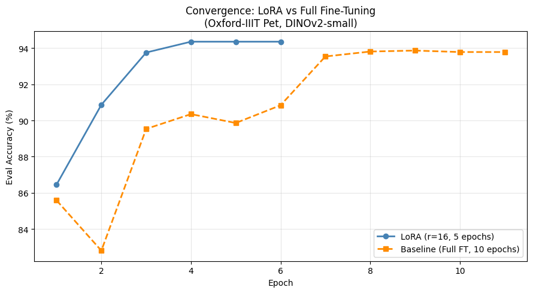
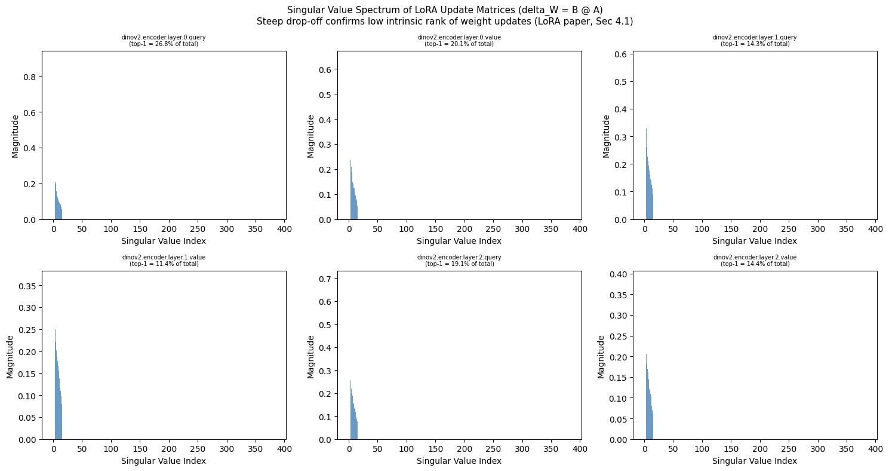
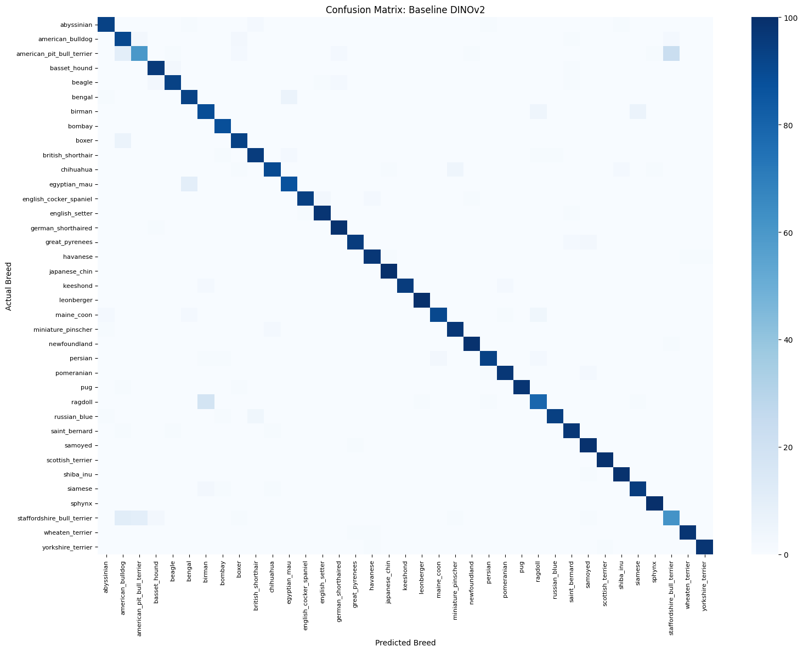
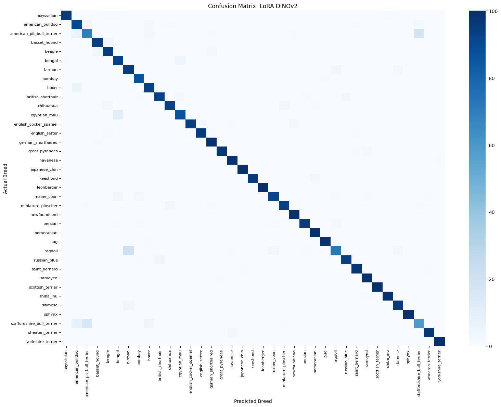

# Parameter-Efficient Fine-Tuning with LoRA on DINOv2

Implementation and experimental study of **Low-Rank Adaptation (LoRA)** for parameter-efficient fine-tuning of a pretrained Vision Transformer.

The project fine-tunes **DINOv2-small** on the **Oxford-IIIT Pet** dataset using the Hugging Face PEFT library and compares LoRA against conventional full fine-tuning.

## Overview

Full fine-tuning updates all parameters of a pretrained model. LoRA instead freezes the pretrained model and learns low-rank update matrices for selected layers.

For a pretrained weight matrix $W_0$, LoRA represents the update as

$$W = W_0 + \frac{\alpha}{r}BA$$

where $r$ is a small rank and $A$ and $B$ are the trainable low-rank matrices.

In this project, LoRA is applied to the **query and value projections** of the Transformer attention blocks. The pretrained DINOv2 backbone remains frozen, while the newly initialized 37-class classifier head is also trained.

## Objectives

- Implement LoRA-based Parameter-Efficient Fine-Tuning using Hugging Face PEFT.
- Fine-tune DINOv2-small on the Oxford-IIIT Pet dataset.
- Compare LoRA against full fine-tuning.
- Compare accuracy, training time, GPU memory usage, and trainable parameters.
- Study the effect of LoRA rank through an ablation experiment.
- Analyze the effective rank of learned LoRA updates using Singular Value Decomposition (SVD).

## Experimental Setup

| Component | Configuration |
|---|---|
| Backbone | DINOv2-small (`facebook/dinov2-small`) |
| Architecture | Vision Transformer |
| Dataset | Oxford-IIIT Pet |
| Classes | 37 |
| Training images | 3,680 |
| Test images | 3,669 |
| LoRA target modules | Query and Value projections |
| Main LoRA rank | \(r=16\) |
| LoRA \(\alpha\) | 32 |
| LoRA dropout | 0.1 |
| Batch size | 32 |
| LoRA epochs | 5 |
| Full FT epochs | 10 |
| LoRA learning rate | \(10^{-3}\) |
| Full FT backbone LR | \(2\times10^{-5}\) |
| Full FT classifier LR | \(10^{-3}\) |
| Scheduler | Cosine decay |
| Warmup | 10% |
| Weight decay | 0.01 |
| Precision | FP16 |

## LoRA vs Full Fine-Tuning

| Metric | Full Fine-Tuning | LoRA (r=16) |
|---|---:|---:|
| Accuracy | 93.79% | **94.36%** |
| Training Time | 674.33 s | **332.78 s** |
| Epochs | 10 | 5 |
| Peak VRAM | 2564.52 MB | **1672.56 MB** |
| Trainable Parameters | 22,085,029 | **323,365** |
| Trainable Percentage | 100.00% | **1.44%** |

LoRA achieved slightly higher accuracy while training only **1.44% of the model parameters** and using substantially less peak GPU memory.

The difference in total training time should not be interpreted as LoRA being twice as fast per epoch. Both approaches still perform the forward pass through the pretrained backbone. The total time difference is influenced by the 5 LoRA epochs versus 10 baseline epochs, in addition to the reduced gradient and optimizer-state computation for the frozen backbone.

## Training Curves



## Rank Ablation

The effect of LoRA rank was evaluated for $r \in \{4,8,16\}$.

| Rank | Trainable Parameters | Accuracy |
|---:|---:|---:|
| 4 | 102,181 | **94.63%** |
| 8 | 175,909 | 94.60% |
| 16 | 323,365 | 94.36% |
| Full Fine-Tuning | 22,085,029 | 93.79% |

A very low rank was sufficient for this task. The \(r=4\) configuration achieved the highest accuracy while using only 102,181 trainable parameters.

## Rank-Deficiency Analysis

To investigate the structure of the learned LoRA updates, the update

$$\Delta W = BA$$

was analyzed using Singular Value Decomposition.

The singular-value spectra show a sharp drop-off, indicating that the learned updates are concentrated in a small number of directions. The analysis suggests an effective rank of approximately 2–3 despite allowing a LoRA rank of 16.



## Confusion Matrices

### Full Fine-Tuning



### LoRA



## Implementation

The implementation uses:

- **PyTorch** for model training
- **Hugging Face Transformers** for DINOv2 and the training framework
- **Hugging Face PEFT** for LoRA
- **Hugging Face Datasets** for the Oxford-IIIT Pet dataset
- **scikit-learn** for evaluation utilities
- **Matplotlib / Seaborn** for visualization

## Repository Structure

```text
lora-dinov2-peft/
├── README.md
├── requirements.txt
├── .gitignore
├── lora_dinov2_oxford_pet.ipynb
└── figures/
    ├── confusion_matrix_baseline_dinov2.png
    ├── confusion_matrix_lora_dinov2.png
    ├── rank_deficiency_analysis.png
    └── training_curves.png
```
## Authors

- Salaj Bansal
- Kushagra Mishra
- Maahir Arora

Course project for **MA 310**, IIT Indore under the guidance of Prof. M. Tanveer
